<div align="center">

<a href="https://github.com/LeVraiLunatix/cordlauncher-releases/releases/latest/download/CordLauncher-Setup.exe">
  
</a>

<br><br>

[](LICENSE)
[](https://github.com/LeVraiLunatix/cordlauncher-releases/releases/latest)


<br>

**Le lanceur de la suite [Cord](https://www.cordsuite.app) : installe, met à jour et lance toutes les apps de la suite, sur ton PC et jusque sur ton iPhone. Sans droits administrateur.**

<br>

<a href="https://github.com/LeVraiLunatix/cordlauncher-releases/releases/latest/download/CordLauncher-Setup.exe">
  
</a>

<sub>[Toutes les versions](https://github.com/LeVraiLunatix/cordlauncher-releases/releases) · [cordsuite.app](https://www.cordsuite.app) · [Compte Cord](https://compte.cordsuite.app) · [Discord](https://discord.gg/EyX2YR6nAy)</sub>

</div>

<br>

<p align="center"></p>

<br>

## En deux mots

CordLauncher joue pour la suite Cord le rôle d'un petit App Store, en plus soigné :

- **Découvrir** les apps de la suite (Drivecord, Passcord, et celles qui arrivent) dans des cartes en verre animées.
- **Installer, mettre à jour, désinstaller** les apps Windows en un clic, dans le profil de l'utilisateur, **sans jamais demander les droits administrateur**.
- **Installer les apps iPhone depuis le PC** avec le compte Apple de l'utilisateur, puis **les renouveler avant qu'elles expirent**, par câble ou **en Wi-Fi**.
- **Se connecter avec le Compte Cord**, l'identité commune de la suite, et en faire une clé avec **Passcord** sur l'iPhone.

Tout le code est ici : l'app (Tauri + React + Rust), le **service Compte Cord** et son portail web, et l'**installateur maison**.

## Architecture

<p align="center"></p>

| Brique | Dossier | Rôle |
|---|---|---|
| **Interface** | [`src/`](src) | React 19, TypeScript, Tailwind 4, Motion. Direction artistique « Liquid Glass ». |
| **Cœur natif** | [`src-tauri/`](src-tauri) | Rust + Tauri 2 : installation Windows, iPhone, Wi-Fi, coffre Windows, notifications, relais vers le Compte Cord. |
| **Compte Cord** | [`account-service/`](account-service) | Service d'identité de la suite (OIDC, Passcord, passkeys, 2FA, Web Push, catalogue) et son portail web, déployé sur [compte.cordsuite.app](https://compte.cordsuite.app). |
| **Installateur** | [`installer/`](installer) | Petite app Tauri sans bordure qui embarque l'installateur NSIS et l'exécute en silence, avec une vraie interface. |
| **Scripts** | [`scripts/`](scripts) | Fabrication et publication des versions. |

## Sous le capot

<details>
<summary><b>🪟 Installer sur Windows, sans droits administrateur</b></summary>
<br>

Tout se passe au niveau de l'utilisateur ([`src-tauri/src/apps.rs`](src-tauri/src/apps.rs)) :

- **Détection** des apps installées dans le registre (`HKCU` / `HKLM\…\Uninstall\<clé>`), avec résolution de l'exécutable à lancer.
- **Téléchargement en flux** (progression, débit, temps restant) et **vérification SHA-256** de l'installateur avant de l'exécuter.
- **Installation silencieuse** (NSIS `/S /D=`, MSI `/qn`), désinstallation silencieuse, lancement détaché.
- **Mises à jour** : prévenir (toast + notification Windows, une fois par version) ou installer tout seul, selon les Réglages.
</details>

<details>
<summary><b>📱 Installer et renouveler les apps iPhone</b></summary>
<br>

iOS refuse toute app qui n'est pas signée par Apple ou par ton compte. CordLauncher s'en charge ([`src-tauri/src/sideload.rs`](src-tauri/src/sideload.rs), moteur [isideload](https://github.com/nab138/isideload)) :

1. connexion au compte Apple (2FA dans l'app), avec **plusieurs profils** et les mots de passe dans le **coffre Windows** ;
2. téléchargement de l'IPA, **enregistrement de l'appareil**, **signature**, puis **envoi** sur l'iPhone, avec une progression réelle à chaque étape ;
3. **registre des apps installées** (`iphone-apps.json`) : la date d'expiration est lue dans le profil de provisionnement embarqué, et une copie de l'IPA est gardée pour renouveler sans rien retélécharger.

Le **mode automatique** ([`src/lib/iphone-apps.ts`](src/lib/iphone-apps.ts)) détecte les nouvelles versions (source AltStore, builds bêta privés), les installe et renouvelle les apps à deux jours de l'expiration. Si l'iPhone n'est pas là, il envoie un **rappel la veille** (Windows + notification du Compte Cord). Les apps de la suite installées autrement (AltStore, Sideloadly) sont repérées et suivies elles aussi.

> **Apple et les erreurs 429.** Depuis septembre 2026, le serveur d'authentification d'Apple refuse au hasard environ une requête sur deux, pour tous les outils de sideload. isideload 0.4 relance chaque requête jusqu'à dix fois ; si Apple refuse encore, CordLauncher met ce compte en pause dix minutes. « Réinitialiser l'appareil Apple » efface l'identité anisette et ces pauses.
</details>

<details>
<summary><b>📶 Le Wi-Fi, sans le service d'Apple</b></summary>
<br>

Sous Windows, le service *Apple Mobile Device* gère mal les iPhone en réseau : il les ignore, ou les liste puis échoue à relayer la connexion. CordLauncher s'en passe ([`src-tauri/src/wifi.rs`](src-tauri/src/wifi.rs)) :

1. quand l'iPhone est branché, il retient son identifiant, son **adresse Wi-Fi** (lue dans le jumelage) et active la connexion sans fil (`EnableWifiConnections` via lockdown) ;
2. débranché, il essaie d'abord sa **dernière adresse IP**, puis le cherche avec **Bonjour** (`_apple-mobdev2._tcp`) ;
3. il s'y connecte **directement** (lockdown, port 62078) : la session chiffrée ne s'ouvre qu'avec le bon iPhone.

Le reste du code ne voit qu'un seul type de connexion, câble ou Wi-Fi (`provider_for(udid)`).
</details>

<details>
<summary><b>🪪 Le Compte Cord et Passcord</b></summary>
<br>

[`account-service/`](account-service) : Node, zéro dépendance côté portail, Postgres (Neon) en production, PGlite pour les tests.

- **OIDC + PKCE S256** pour « Continuer avec Cord » dans Drivecord et les autres apps (première partie sans écran de consentement).
- **Passcord** : l'iPhone est la clé du compte (Ed25519, Face ID). Depuis un PC, « Envoyer à mon iPhone » : la demande arrive dans Passcord **et** en notification, avec un **nombre à choisir** parmi trois (un mauvais choix annule la demande), et un bouton « Ce n'est pas moi ».
- **Web Push maison** ([`lib/push.mjs`](account-service/lib/push.mjs)) : VAPID + chiffrement `aes128gcm`, vérifié octet par octet sur le vecteur de test de la RFC 8291, clés générées au premier besoin et gardées chiffrées.
- **Passkeys, double authentification, codes de secours**, sessions, apps connectées, export RGPD, administration des bêtas fermées.
- **Catalogue** (`/api/catalog`) : la liste des apps et la dernière version de CordLauncher, lus par le launcher sans le redistribuer.
- Portail sous CSP stricte (`script-src 'self'`, rien en ligne, aucun CDN), migrations uniquement additives.
</details>

<details>
<summary><b>💬 Des erreurs qui parlent français</b></summary>
<br>

Les erreurs d'Apple, d'isideload, d'idevice ou du réseau arrivent en anglais technique (« device socket io failed »). `humanize()` ([`sideload.rs`](src-tauri/src/sideload.rs)) les traduit en une phrase qui dit quoi faire, par exemple « Impossible de joindre l'iPhone. Déverrouille-le et vérifie le câble, ou qu'il est sur le même Wi-Fi que ce PC. » Le détail complet reste dans `%LOCALAPPDATA%\app.cordsuite.launcher\logs\iphone.log`.
</details>

<details>
<summary><b>🧊 Le piège du verre</b></summary>
<br>

Dans Chromium (donc WebView2), un ancêtre avec `opacity < 1`, `filter`, `mask`, `clip-path` ou `backdrop-filter` devient la racine de fond de ses descendants : leur `backdrop-filter` ne voit plus le fond de la fenêtre, et le verre paraît plat. D'où la règle suivie partout : **on anime l'opacité des vitres elles-mêmes, jamais d'un conteneur qui les englobe.**
</details>

## Structure

```
src/                         interface (React)
  App.tsx                    coquille : ouverture, accueil du premier lancement, navigation
  components/glass/          briques « Liquid Glass » (carte, bouton, modale, interrupteur…)
  components/shell/          barre de titre, navigation, accueil (Welcome), toasts
  components/apps/           fiche d'app, installation Windows et iPhone, compte Apple
  views/                     Découvrir · Bibliothèque · iPhone · Compte Cord · Réglages
  lib/                       catalogue, installation, iPhone, compte, mises à jour, réglages
src-tauri/src/
  apps.rs                    installation Windows (registre, téléchargement + SHA-256, NSIS/MSI)
  sideload.rs                compte Apple, signature et installation iPhone, erreurs lisibles
  wifi.rs                    iPhone en Wi-Fi direct (Bonjour, dernière IP, lockdown)
  iphone_apps.rs             registre des apps iPhone, expiration, versions sur l'appareil
  account.rs                 relais HTTP vers le Compte Cord (session dans le coffre Windows)
account-service/             service Compte Cord, portail web, tests
installer/                   installateur maison (Tauri) qui embarque le NSIS
scripts/                     build-setup.cjs · publish-setup.cjs
public/apps.json             catalogue de la suite (copie embarquée, servie aussi par le Compte Cord)
```

## Démarrer

**Prérequis :** Windows 10 ou 11, Node 22 ou plus, Rust stable (MSVC) avec la charge « Développement Desktop en C++ » de Visual Studio. Pour l'iPhone : iTunes ou l'app *Appareils Apple* (service Apple Mobile Device).

```bash
npm install
npm run app:dev       # fenêtre Tauri + Vite (port 1430)
npm run dev           # interface seule dans un navigateur (installation simulée)
npm run typecheck     # tsc --noEmit

cd account-service
npm run dev           # Compte Cord en local sur http://127.0.0.1:4319
npm test              # 29 tests (node --test, base PGlite en mémoire)
npm run portal        # régénère le portail et le catalogue après une modification
```

Le premier `cargo build` prend quelques minutes (le moteur iPhone est volumineux), les suivants sont rapides. `?intro=0` saute l'animation d'ouverture en développement.

## Publier une version

```bash
# 1. monter la version dans package.json (la seule source de vérité)
npm run setup:build                      # app + NSIS + installateur maison → dist-setup/
npm run setup:publish -- "Notes de version"
cd account-service && vercel deploy --prod
```

`setup:publish` crée la release sur le dépôt public [cordlauncher-releases](https://github.com/LeVraiLunatix/cordlauncher-releases) (fichier stable `CordLauncher-Setup.exe`), puis inscrit la version, l'URL et l'empreinte dans le catalogue. Les CordLauncher déjà installés la proposent dans **Réglages › Rechercher une mise à jour**.

> Le `Cargo.lock` de l'installateur doit rester aligné sur celui de `src-tauri/`, et les paquets `@tauri-apps/*` sur les crates Rust : `tauri build` refuse sinon.

## Compte Cord en production

Déployé sur Vercel ([compte.cordsuite.app](https://compte.cordsuite.app)), base Postgres chez Neon. Variables d'environnement :

| Variable | Rôle |
|---|---|
| `CORD_ISSUER` | Origine publique du service |
| `DATABASE_URL` | Base Postgres |
| `CORD_OIDC_KEY` · `CORD_DATA_KEY` | Clé de signature OIDC · clé de chiffrement des données sensibles |
| `CORD_CLIENTS` | Apps autorisées (identifiants, secrets, adresses de retour) |
| `CORD_ADMINS` | Adresses des administrateurs |
| `RESEND_API_KEY` · `CORD_MAIL_FROM` | Envoi des e-mails |
| `PASSCORD_RELEASES_REPO` · `PASSCORD_RELEASES_TOKEN` | Builds privés de la bêta Passcord (le jeton peut aussi se coller depuis l'administration) |

Règles de la maison : migrations **uniquement additives**, portail sans script ni style en ligne, `npm run portal` puis `npm test` avant chaque déploiement.

## Feuille de route

- [x] Interface « Liquid Glass », Découvrir · Bibliothèque · iPhone · Compte · Réglages
- [x] Installation Windows sans admin, vérification SHA-256, mises à jour automatiques
- [x] Installation iPhone par câble, profils Apple, renouvellement et mises à jour automatiques
- [x] iPhone en Wi-Fi direct
- [x] Compte Cord : OIDC, Passcord, passkeys, 2FA, Web Push, catalogue en ligne
- [x] Accueil au premier lancement, installateur maison, mise à jour de CordLauncher
- [ ] Signature de code de l'installateur (SmartScreen)
- [ ] CSP stricte dans la fenêtre Tauri

## Contribuer

Les contributions sont les bienvenues ! Lis [CONTRIBUTING.md](CONTRIBUTING.md) : on en parle d'abord sur le [Discord](https://discord.gg/EyX2YR6nAy), une PR = un sujet, et chaque commit est signé (`git commit -s`, [DCO](https://developercertificate.org/)).

Une faille de sécurité ? Ne l'ouvre pas en public : voir [SECURITY.md](SECURITY.md).

## Licence

Copyright © 2026 **Lunatix**.

Le code est distribué sous licence **[GNU AGPL v3.0 ou ultérieure](LICENSE)** : tu peux le lire, l'utiliser, le modifier et le redistribuer, à condition de partager tes modifications sous la même licence, y compris si tu le fais tourner comme service en ligne. Les noms et logos de la suite Cord n'en font pas partie : voir [NOTICE.md](NOTICE.md).

<br>

<div align="center">

<a href="https://www.cordsuite.app"></a>

<sub>Fait avec 💜 par Lunatix · <a href="https://www.cordsuite.app">cordsuite.app</a></sub>

<sub>CordLauncher n'est affilié ni à Apple ni à Discord.</sub>

</div>
